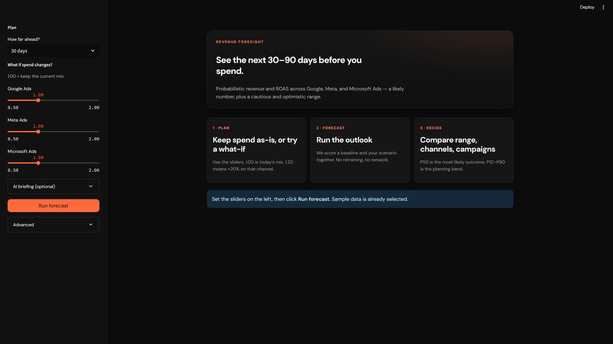
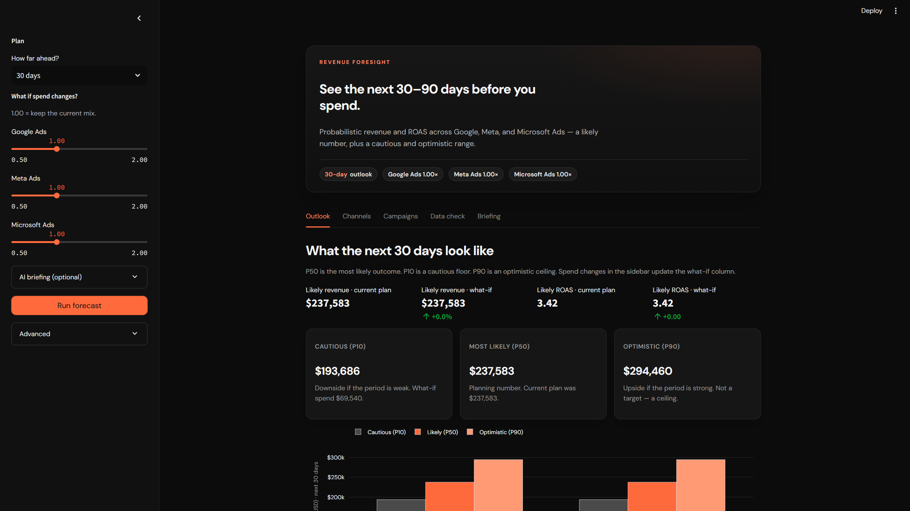
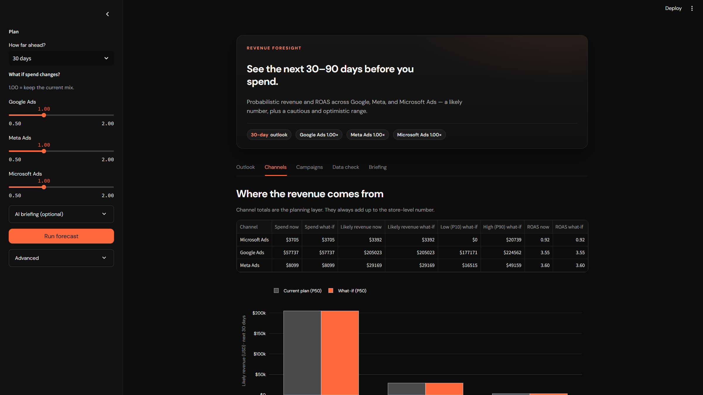

# Revenue Foresight

Probabilistic ecommerce **revenue** and **ROAS** forecasting across Google Ads, Meta Ads, and Microsoft Ads.

**Python:** 3.12.x

Holdout TEST (sample data, `scripts/evaluate.py`): model wMAPE **0.500** vs run-rate baseline **1.234** (**59.5%** lift, excl. Bing); P10–P90 coverage **74.0%** via Mondrian split-conformal (chronological 60/20/20 train/calib/test).

---

## Demo

Plan a mix, then score the next 30 / 60 / 90 days — a likely number plus a cautious and optimistic range.







```bash
pip install -r requirements-demo.txt
streamlit run app.py
```

## Streamlit Community Cloud

1. Push this repo to GitHub (public), including `pickle/model.pkl`, `app.py`, `requirements.txt`, and `packages.txt`.
2. Open [share.streamlit.io](https://share.streamlit.io) and sign in with GitHub.
3. **Create app** → **Yup, I have an app**.
4. Fill in:
   - Repository: `Malviya8/Revenue-Foresight` (or your fork)
   - Branch: `main`
   - Main file path: `app.py`
   - App URL (optional): `revenue-foresight`
5. **Advanced settings** → Python version **3.12** → Save.  
   Cloud currently defaults to **3.14**, which cannot install `pandas==2.2.3` (you will see `cmake` errors). The log must say `Using Python 3.12`, not `3.14`.
6. Click **Deploy**. First build takes a few minutes (LightGBM + Plotly).
7. On the live app, click **Run forecast** (about 30 seconds the first time).

Optional LLM briefing: App settings → Secrets:

```toml
GROQ_API_KEY = "your-key"
```

Do not put keys in GitHub.

---

## Quick start

```bash
pip install -r requirements.txt
./run.sh ./data ./pickle/model.pkl ./output/predictions.csv
# Windows: .\run.ps1 ./data ./pickle/model.pkl ./output/predictions.csv
python src/verify_output.py
```

Contract: three args (`DATA_DIR`, `MODEL_PATH`, `OUTPUT_PATH`) with those defaults.
No network, no prompts, no retraining at score time.

---

## Repository layout

```
├── run.sh / run.ps1       # Scoring entrypoint
├── app.py                 # Streamlit demo UI
├── llm_layer.py           # Optional AI causal insights
├── requirements.txt       # Pinned score-time deps
├── requirements-demo.txt  # Streamlit (+ score deps) for demo only
├── data/                  # Channel CSVs (replaced at test time)
├── pickle/model.pkl       # Trained LightGBM quantile bundle
├── scenarios/             # Example budget what-ifs
├── src/                   # Ingest → features → model → predict
├── demo/                  # Streamlit prototype + LLM insights
├── docs/                  # Methodology, architecture, walkthrough, demo screenshots
└── output/                # Local artifacts (gitignored except .gitkeep)
```

---

## Documentation

| Doc | Purpose |
|-----|---------|
| [`docs/methodology.md`](docs/methodology.md) | Forecasting method, model, preprocessing, assumptions, limits, AI |
| [`docs/architecture.md`](docs/architecture.md) | Frontend / backend / pipeline / LLM flow |
| [`docs/demo_walkthrough.md`](docs/demo_walkthrough.md) | 5–7 min presentation script |
| [`docs/output_contract.md`](docs/output_contract.md) | `predictions.csv` schema |
| [`docs/release_checklist.md`](docs/release_checklist.md) | Pre-publish checks |
| [`docs/data_assumptions.md`](docs/data_assumptions.md) | Cleaning + attribution policy |
| [`docs/modeling_decision.md`](docs/modeling_decision.md) | Why LightGBM (+ sklearn), not Prophet-primary |
| [`docs/backtest_results.md`](docs/backtest_results.md) | Holdout metrics summary |

---

## Schema map (raw → unified)

| Unified | Google | Meta | Bing |
|---------|--------|------|------|
| `date` | `segments_date` | `date_start` | `TimePeriod` |
| `spend` | `metrics_cost_micros / 1e6` | `spend` | `Spend` |
| `revenue` | `metrics_conversions_value` | `conversion` | `Revenue` |
| `campaign_type` | channel type col | inferred from name | `CampaignType` |

Platform attribution is used as-is (no custom MMM).

---

## Local workflows

**Train (offline only):**
```bash
python src/train.py --data-dir ./data --model-out ./pickle/model.pkl
```

**Evaluate (TEST holdout metrics):**
```bash
python scripts/evaluate.py
```
Writes `output/evaluation_report.txt` + `output/evaluation_metrics.json`.
Headline numbers are also frozen in [`docs/evaluation_snapshot.json`](docs/evaluation_snapshot.json).

**Optional fair Prophet benchmark (evaluation only):**
```bash
pip install -r requirements-eval.txt
python scripts/evaluate.py --with-prophet
```
This refits Prophet at each TEST cutoff and compares it with LightGBM and
run-rate on exactly the same Google/Meta channel-level rows. Prophet is not
installed or invoked by the offline scoring path.

**Budget simulation:**
```bash
python src/simulate.py --budget-json scenarios/meta_plus20.json \
  --out ./output/predictions_meta_plus20.csv
```

**Demo:**
```bash
pip install -r requirements-demo.txt
streamlit run app.py
```
Uses root `app.py` + `llm_layer.py`. Free LLM: set `GROQ_API_KEY` from
[console.groq.com](https://console.groq.com) (or paste in the sidebar). Falls
back to offline heuristic with no key.

---

## At a glance

1. **Problem:** probabilistic multi-channel revenue/ROAS planning under budget what-ifs.
2. **Approach:** LightGBM P10/P50/P90 + Mondrian split-conformal + hierarchy reconcile.
3. **Holdout:** wMAPE **0.500** vs run-rate **1.234** (**59.5%** lift, excl. Bing); coverage **74.0%**.
4. **Score:** `./run.sh ./data ./pickle/model.pkl ./output/predictions.csv` then `python src/verify_output.py`.
